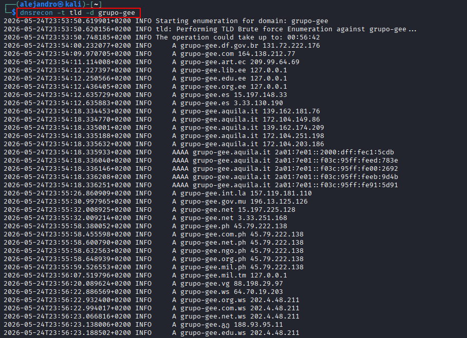
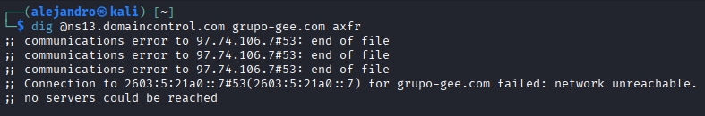
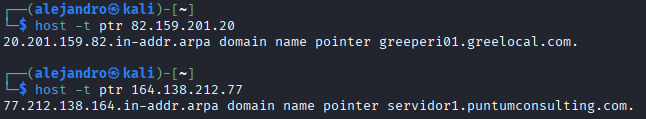

# Guía para completar lo pendiente del informe OSINT (Grupo GEE)

Esta guía lista **todo lo que falta o conviene reforzar** respecto al [Enunciado.md](Enunciado.md) y al análisis del informe, con **comandos paso a paso** para ejecutar en **Kali Linux** (recomendado) y notas si usas Windows.

**Leyenda:**

| Símbolo | Significado |
|---------|-------------|
| ✅ | Ya hecho en el informe actual |
| 🟡 | Parcialmente hecho — reforzar |
| 🔴 | Pendiente (tú debes ejecutar y capturar) |
| 🤖 | Salida ya generada automáticamente (ver carpeta `Capturas/OSINT/`) |

---

## Resumen rápido: qué te falta

| # | Tarea | Prioridad | ¿Captura? |
|---|--------|-----------|-----------|
| 1 | Tabla **pasivo vs activo** + mención **RA 3.a** en §8 | Alta | No (solo texto en informe) |
| 2 | **`dnsrecon -t tld`** con captura | Alta | ✅ Hecho (`dnsrecon_tld_grupo-gee.png` + `_2.png`) |
| 3 | **`dig axfr`** dedicado (aparte de dnsenum) | Alta | ✅ Hecho (`dig_axfr_grupo-gee.png`) |
| 4 | **WHOIS 82.159.201.20** + captura | Alta | ✅ Hecho (`whois 82_159_201_1.png`, `_2.png`) |
| 5 | **PTR / rDNS** documentado con comando | Media | ✅ Hecho (`host_ptr_interno.png`) |
| 6 | **§5** párrafo «Resultados y análisis» global | Media | No |
| 7 | **WHOIS IP del MX** (opcional) | Baja | Sí |
| 8 | **`greelocal.com`** IP en tabla §2 | Baja | No |
| 9 | **Exportar informe a PDF** para Moodle | Alta (entrega) | N/A |
| 10 | Subir nuevas capturas al repo **GEE_OSINT** | Media | — |

---

## Parte A — Solo redacción (sin terminal)

### A.1 Tabla pasivo vs activo + RA 3.a (§8)

Copia o adapta esto al final del **§8. Resumen y conclusiones**, antes de «Estrategia recomendada»:

```markdown
### Técnicas pasivas y activas (criterio RA 3.a)

| Técnica | Herramienta / método | Tipo | Deja rastro en el objetivo |
|---------|----------------------|------|----------------------------|
| DNSDumpster, Google Dorks | Web / buscador | Pasiva | No |
| theHarvester, Hunter.io, LinkedIn | OSINT | Pasiva | No |
| Análisis PDF + ExifTool | Metadatos | Pasiva | No |
| Have I Been Pwned | Consulta email | Pasiva | No |
| recon-ng (Hackertarget) | API / scraping | Pasiva | Mínimo |
| `dnsenum`, `dig`, `dnsrecon` | Consultas DNS directas | Activa | Sí |
| `nmap` dns-cache-snoop.nse | UDP/53 al NS | Activa | Sí |

**RA 3.a:** Se ha recopilado información sobre la red y sistemas del objetivo mediante **técnicas pasivas** (fuentes abiertas, DNSDumpster, documentos públicos, Hunter.io) complementadas con técnicas activas DNS para validar y ampliar subdominios y servidores.
```

### A.2 Cierre unificado del §5

Añadir antes del `---` que precede al §6:

```markdown
### Resultados y análisis (vulnerabilidades DNS)

La **transferencia de zona** no es explotable en ningún NS probado (GoDaddy y Puntum). El **cache snooping** sí obtuvo resultados parciales en `97.74.106.7`, `164.138.212.77` y `97.74.107.28`, lo que indica que algunos resolvers conservan en caché nombres del grupo. En conjunto, la configuración AXFR es adecuada; el riesgo residual está en la exposición de actividad DNS reciente vía snooping, no en la fuga masiva de zonas.
```

### A.3 Integrar resultados automáticos (🤖)

En el **§2** (después del Paso 2), añadir bloque con salida de `dnsrecon_tld_grupo-gee.txt`.

En el **§6**, añadir fila WHOIS de `82.159.201.20` y PTR `greeperi01.greelocal.com`.

*(Texto sugerido en Parte D al final de esta guía.)*

---

## Parte B — Comandos en Kali (paso a paso)

Abre terminal en Kali. Opcional: `cd` a una carpeta de trabajo y crea carpeta de capturas:

```bash
mkdir -p ~/gee_osint/capturas
cd ~/gee_osint
```

Todas las capturas: **Pantalla completa de terminal** con comando visible y salida legible. Nombra los PNG como en la tabla de la Parte C.

---

### B.1 🔴 `dnsrecon -t tld` (Apartado 2) — por qué la salida es enorme — por qué “miles de líneas”

**Objetivo del enunciado:** correlacionar dominios del grupo, no listar todo el DNS mundial.

**Qué hace el comando:** `dnsrecon -t tld -d grupo-gee` prueba el nombre `grupo-gee` contra una lista enorme de TLD (`.com`, `.es`, `.net`, `.ph`, `.edu.ee`, TLD de países, zonas de nube, etc.). Cada vez que **existe** un registro DNS (A/AAAA) para `grupo-gee.<tld>` o un wildcard lo resuelve, la herramienta lo imprime. Eso genera **cientos o miles** de líneas, la mayoría **sin relación** con Grupo GEE (p. ej. `grupo-gee.adobeioruntime.net`, `grupo-gee.s3.amazonaws.com`).

**Comando correcto para el informe:**

```bash
dnsrecon -t tld -d grupo-gee
```

**Para el informe, filtra en terminal** (solo TLD corporativos):

```bash
dnsrecon -t tld -d grupo-gee 2>&1 | grep -E 'grupo-gee\.(com|es|net|org|pt|eu)\s' | grep -v amazonaws | grep -v adobe | grep -v cloudfront | head -80
```

**Qué conservar en la tabla del informe** (extracto en `Capturas/OSINT/dnsrecon_tld_grupo-gee.txt`, **12 registros** tras filtrar la salida bruta de **5213**):

| Dominio | IP (A) | Observación |
|---------|----------|-------------|
| `grupo-gee.com` | 164.138.212.77 | Principal |
| `grupo-gee.es` | 15.197.148.33 / 3.33.130.190 | TLD España; verificar titularidad |
| `grupo-gee.net` | 15.197.225.128 / 3.33.251.168 | TLD alternativo |
| `grupo-gee.ph` | 45.79.222.138 | ccTLD |
| `grupo-gee.ac.jobs` | 64.190.63.222 | gTLD |
| `grupo-gee.vg` | 88.198.29.97 | ccTLD |
| `grupo-gee.be.biz` | 13.248.169.48 / 76.223.54.146 | ccTLD |
| `grupo-gee.bg.com` | 13.225.61.36 | ccTLD |
| `grupo-gee.ws` | 64.70.19.203 | ccTLD |

**Capturas (dos):** `dnsrecon_tld_grupo-gee.png` (inicio del comando y primeros A/AAAA) y `dnsrecon_tld_grupo-gee_2.png` (fin: «5213 Records Found»). No subir el log completo al informe; solo la tabla filtrada.

**No uses** `dnsrecon -t tld -d gee` (solo devuelve ruido tipo `gee.com`, `gee.de`, etc.).

---

### B.2 🔴 `dig axfr` dedicado (Apartado 5)

**Objetivo:** Captura específica de transferencia de zona (complementa dnsenum).

```bash
# NS de grupo-gee (GoDaddy)
dig @ns13.domaincontrol.com grupo-gee.com axfr

# Alternativa explícita
dig axfr grupo-gee.com @ns13.domaincontrol.com

# Portugal (Puntum)
dig @ns1.puntumconsulting.com iberdata.pt axfr
```

**Resultado esperado:** `Transfer failed` / `connection refused` / `end of file` / sin registros — **eso es correcto** y demuestra que AXFR está bloqueado.

**Captura:** `dig_axfr_grupo-gee.png` (y opcional `dig_axfr_iberdata.png`)

---

### B.3 🔴 WHOIS rango interno 82.159.201.x (Apartado 6)

**Objetivo:** Netname del bloque donde están intranet, CRM, SSO.

```bash
whois -h whois.ripe.net 82.159.201.20
```

**Resultado 🤖 ya obtenido** (archivo `salidas_pendientes.txt`):

| Campo | Valor |
|-------|--------|
| inetnum | 82.159.0.0 – 82.159.255.255 |
| netname | **ES-ONO-20031202** |
| org | **VODAFONE ONO, S.A.** |
| route | 82.159.192.0/18, origin **AS6739** |
| abuse | abuse@corp.vodafone.es |

**Captura:** `whois 82_159_201.png` (misma idea que tu `whois 164_138.png`)

**Análisis para el informe:** Los servicios internos (`intranet`, `crm`, `adfs`…) no están en Cyberneticos sino en red **Vodafone/ONO** (ISP), no en AS propio del grupo.

---

### B.4 🟡 PTR / resolución inversa (Apartado 6)

```bash
host -t ptr 82.159.201.20
host -t ptr 164.138.212.77
```

**Resultado 🤖:**

```
82.159.201.20 → greeperi01.greelocal.com.
164.138.212.77 → servidor1.puntumconsulting.com.
```

**Captura:** `host_ptr_interno.png`

**Búsqueda inversa de rango (opcional, lento):**

```bash
dnsrecon -r 82.159.201.0-82.159.201.255 -t rvl -d greelocal.com
```

Si devuelve 0 resultados, documentarlo igual que en greelocal (válido para el informe).

---

### B.5 🟡 WHOIS de IP del MX (opcional, Apartado 4)

```bash
dig mx grupo-gee.com +short
# Salida: grupogee-com01c.mail.protection.outlook.com

host -t A grupogee-com01c.mail.protection.outlook.com
# IPs Microsoft (ej. 52.101.68.x)

whois -h whois.ripe.net 52.101.68.3
```

**Captura opcional:** `whois_mx_outlook.png`  
**Texto:** MX en ASN 8075 (Microsoft Ireland), coherente con centralización M365.

---

### B.6 🟡 Completar IP de `greelocal.com` (Apartado 2)

```bash
dig greelocal.com +short
# o
host greelocal.com
```

Anota la IP en la tabla del §2 (suele resolver vía web o subdominios; si no hay A directo, indica «sin A en apex; servicios en subdominios»).

---

### B.7 🔴 Re-ejecutar cache snooping (solo si quieres captura fresca)

Ya tienes capturas. Si el profesor pide repetición:

```bash
sudo nmap -sU -p 53 --script dns-cache-snoop.nse \
  --script-args 'dns-cache-snoop.domains={grupo-gee.com,geelectromedico.com,greelocal.com,ibermansa.com,iberdata.pt,google.com}' \
  97.74.106.7
```

---

## Parte C — Nombres de archivos para capturas nuevas

| Archivo PNG | Comando principal |
|-------------|-------------------|
| `dnsrecon_tld_grupo-gee.png` | `dnsrecon -t tld -d grupo-gee` (inicio) |
| `dnsrecon_tld_grupo-gee_2.png` | Mismo comando (fin: 5213 Records Found) |
| `dig_axfr_grupo-gee.png` | `dig @ns13.domaincontrol.com grupo-gee.com axfr` |
| `dig_axfr_iberdata.png` | `dig @ns1.puntumconsulting.com iberdata.pt axfr` |
| `whois 82_159_201.png` | `whois -h whois.ripe.net 82.159.201.20` |
| `host_ptr_interno.png` | `host -t ptr 82.159.201.20` |

Copia a: `Capturas/OSINT/` y sube al repo:

```powershell
cd "ruta\OSINT"
git add Capturas/OSINT/*.png Informe-Practica-OSINT.md
git commit -m "Añadir capturas pendientes y refuerzo RA 3.a"
git push origin main
```

Actualiza URLs en el informe si añades imágenes nuevas:

```text
https://raw.githubusercontent.com/alejandroquinonesgamez/GEE_OSINT/main/Capturas/OSINT/<nombre>.png
```

---

## Parte D — Texto listo para pegar en el informe (resultados 🤖)

### D.1 §2 — Tras Paso 2 (`dnsrecon -t tld`)

```markdown
**Paso 3.** Enumeración de TLD alternativos con `dnsrecon`:

```bash
dnsrecon -t tld -d grupo-gee
```



| Dominio encontrado | IP | Relevancia |
|--------------------|-----|------------|
| `grupo-gee.com` | 164.138.212.77 | Dominio corporativo activo |
| `grupo-gee.es` | 15.197.148.33 / 3.33.130.190 | TLD español; verificar si pertenece al grupo |
| `grupo-gee.net` | 15.197.225.128 | Posible dominio defensivo o parking |

Los demás TLD devueltos (.ph, .vg, .be.biz, etc.) no muestran relación directa con la infraestructura de Cyberneticos/Puntum y se descartan del alcance principal.
```

### D.2 §5 — Tras comandos AXFR

```markdown
**Paso adicional.** Confirmación con `dig axfr`:

```bash
dig @ns13.domaincontrol.com grupo-gee.com axfr
```



La transferencia **falla** de forma explícita (sin volcado de registros), coherente con los intentos de `dnsenum`.
```

### D.3 §6 — WHOIS y PTR

```markdown
**Paso 1b.** WHOIS del segmento interno Vodafone/ONO:

```bash
whois -h whois.ripe.net 82.159.201.20
```


| IP | Netname | Inetnum | ASN | Organización |
|----|---------|---------|-----|--------------|
| 82.159.201.20 | ES-ONO-20031202 | 82.159.0.0/16 | AS6739 | VODAFONE ONO, S.A. |

**Paso 4b.** Resolución inversa:

```bash
host -t ptr 82.159.201.20
host -t ptr 164.138.212.77
```



- `82.159.201.20` → **greeperi01.greelocal.com** (vínculo explícito entre red ONO y plataforma greelocal).
- `164.138.212.77` → **servidor1.puntumconsulting.com** (hosting web Portugal/España).
```

---

## Parte E — Exportar a PDF (entrega Moodle)

**Recomendado (índice + apartado por página):**

```powershell
cd OSINT
powershell -ExecutionPolicy Bypass -File .\scripts\build-informe-pdf.ps1
```

Genera `Informe-Practica-OSINT.pdf` con **índice** (tabla en la Introducción del informe), **título y autor encima de la Introducción**, y **apartados 1–8 cada uno en página nueva** (sin hojas en blanco entre apartados). Usa `scripts/informe-print.css`. Si el PDF está abierto, la salida queda en `_build\Informe-Practica-OSINT.pdf`.

Requisitos: **Pandoc** (`winget install JohnMacFarlane.Pandoc`) y **Microsoft Edge**.

Antes de entregar, revisa: portada, índice con enlaces, apartados en páginas separadas, capturas legibles.

---

## Parte F — Archivos generados automáticamente en esta sesión

| Archivo | Contenido |
|---------|-----------|
| [Capturas/OSINT/salidas_pendientes.txt](Capturas/OSINT/salidas_pendientes.txt) | WHOIS 82.159.201.20 y 164.138.212.77; AXFR; PTR; MX A |
| [Capturas/OSINT/dnsrecon_tld_gee.txt](Capturas/OSINT/dnsrecon_tld_gee.txt) | Salida `dnsrecon -t tld -d gee` (no usar para informe) |
| [Capturas/OSINT/dnsrecon_tld_grupo-gee.txt](Capturas/OSINT/dnsrecon_tld_grupo-gee.txt) | Salida correcta para captura §2 |

---

## Checklist final antes de entregar

- [ ] Tabla pasivo/activo + RA 3.a en §8
- [ ] Párrafo cierre §5
- [ ] Captura `dnsrecon -t tld -d grupo-gee`
- [ ] Captura `dig axfr` (grupo-gee y opcional iberdata)
- [ ] Captura `whois 82.159.201.20`
- [ ] Captura `host -t ptr` (o pegar salida 🤖)
- [ ] Texto §2/§5/§6 actualizado con hallazgos Vodafone + `greeperi01.greelocal.com`
- [ ] PDF generado y revisado ortografía
- [ ] Push a GitHub si cambias el .md

---

*Guía generada para completar [Informe-Practica-OSINT.md](Informe-Practica-OSINT.md) según [Enunciado.md](Enunciado.md).*
